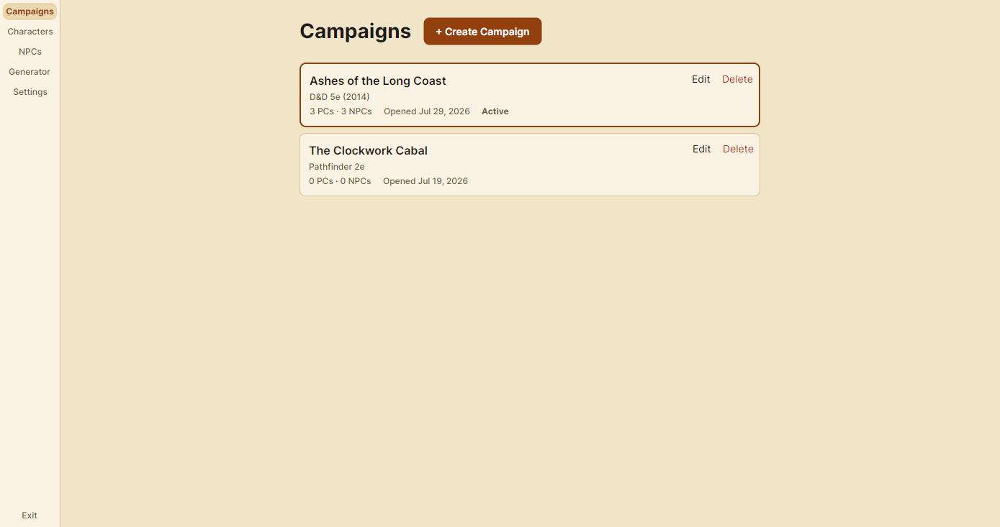
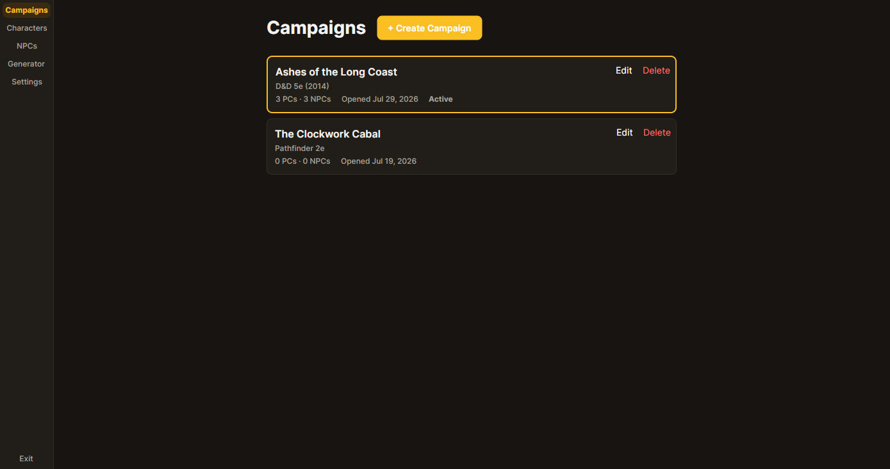
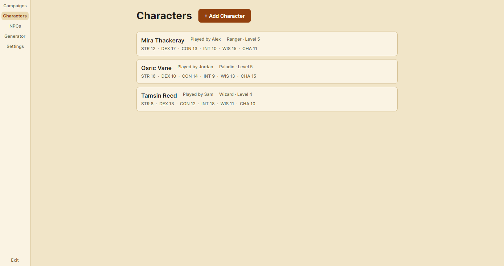
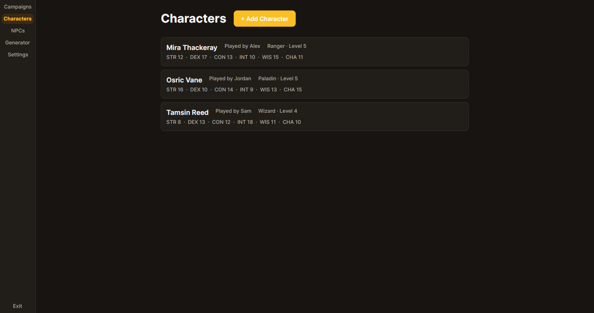
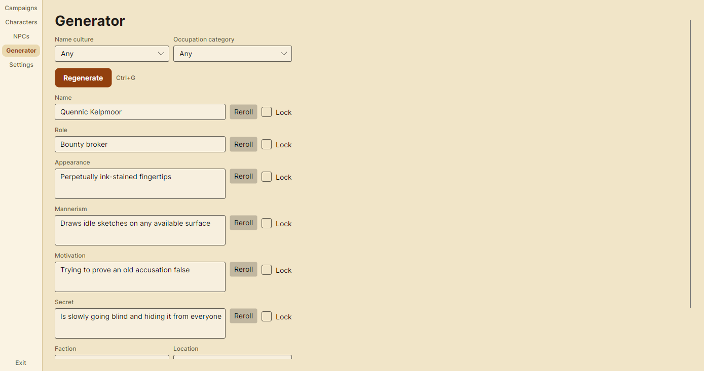
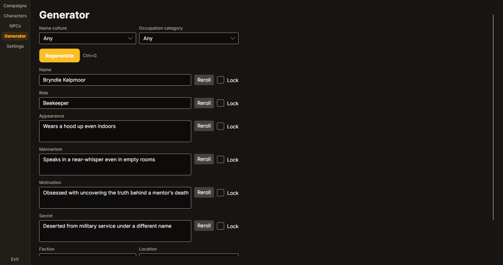

# GM Toolkit

> A cross-platform Game Master's companion for tabletop RPGs. Manage campaigns, player characters and NPCs — and generate NPCs on the fly when your players walk into the tavern and ask the barkeep's name.

[](https://github.com/cclapham/gm-toolkit/actions/workflows/build.yml)
[](LICENSE)
[](https://dotnet.microsoft.com/)
[](https://avaloniaui.net/)

**Status:** alpha — the [MVP](MVP.md) is out as `v0.1.0`. Post-MVP work (see [ROADMAP.md](ROADMAP.md)) may still bring breaking changes.

---

## What it does

GM Toolkit is a local-first desktop and mobile app for running tabletop games. It is deliberately **system-agnostic**: it doesn't try to implement any publisher's rules, so it works whether you run D&D, Pathfinder, Call of Cthulhu, Blades in the Dark or something homebrew.

| Area | What you get |
| --- | --- |
| **Campaigns** | Create campaigns, each a container for its own cast, notes and sessions |
| **Player characters** | A roster of PCs with player name, key stats, notes and passive values you look up mid-session |
| **NPCs** | Full CRUD, tagged by role, faction and location, searchable |
| **NPC generator** | Weighted random tables produce a name, appearance, mannerism, motivation and secret — reroll any single field, then save straight into the campaign |

Everything is stored locally in SQLite. No account, no server, no telemetry.

## Why another one?

Most GM tools are either web-only (useless at a table with no wifi), locked to one rules system, or subscription-gated. This one is offline-first, free, MIT-licensed, and built to be forked — see [Forking this project](#forking-this-project).

## Screenshots

_Populated with invented campaign/character names — no content from published books._

| | Light | Dark |
| --- | --- | --- |
| **Campaigns** |  |  |
| **Player characters** |  |  |
| **NPC generator** |  |  |

---

## Tech stack

- **.NET 10** — runtime and cross-platform build pipeline
- **Avalonia UI** (AXAML + MVVM) for all screens — a native, non-webview cross-platform UI framework with genuine Linux desktop support, ARM included
- **sqlite-net-pcl** for local persistence (SQLite, no server, no ORM ceremony)
- **xUnit** for Core/Data unit tests
- **GitHub Actions** for CI builds and tests — plain `dotnet build`/`dotnet test`, no game-engine-specific CI needed

### Project layout

```
gm-toolkit/
├── GmToolkit.slnx
├── src/
│   ├── GmToolkit.Core/          # domain models, generator engine — plain C#, no Avalonia or SQLite references
│   ├── GmToolkit.Data/           # sqlite-net-pcl repositories, references Core
│   ├── GmToolkit.UI/             # Avalonia views and view models (MVVM), references Core
│   ├── GmToolkit.Desktop/        # Windows/Linux desktop head, references UI + Data + Core
│   └── GmToolkit.Android/        # Android head, references UI + Data + Core
├── tests/
│   ├── GmToolkit.Core.Tests/     # references Core, xUnit
│   └── GmToolkit.Data.Tests/     # references Data
├── Resources/
│   └── GeneratorTables/          # embedded JSON tables (names, appearance, mannerism, motivation, occupation, secret)
└── .github/workflows/
```

The dependency rule is one-way: `Desktop`/`Android` → `UI` → `Core` ← `Data`. `Core` references nothing of ours and stays as close to plain C# as possible. If you find yourself wanting `Core` to know about SQLite or Avalonia, that's the signal to stop and reconsider.

---

## Getting started

### Prerequisites

1. **[.NET 10 SDK](https://dotnet.microsoft.com/download)**
2. **Avalonia project templates** — only needed if you're scaffolding new projects: `dotnet new install Avalonia.Templates`
3. **Android builds** additionally need the Android SDK — `dotnet workload install android` plus Android Studio's command-line tools (or Android Studio itself if you want the emulator)
4. **An editor** — JetBrains Rider (first-class Avalonia previewer support), VS Code with the C# Dev Kit and Avalonia extensions, or Visual Studio

### Build and run

```bash
git clone https://github.com/cclapham/gm-toolkit.git
cd gm-toolkit
dotnet restore
```

- **Desktop (Windows/Linux), run directly:** `dotnet run --project src/GmToolkit.Desktop`
- **Publish a self-contained build:**
  ```bash
  dotnet publish src/GmToolkit.Desktop -r win-x64 --self-contained
  dotnet publish src/GmToolkit.Desktop -r linux-x64 --self-contained
  dotnet publish src/GmToolkit.Desktop -r linux-arm64 --self-contained   # Raspberry Pi 4
  ```
- **Android:** `dotnet build src/GmToolkit.Android -f net10.0-android` produces a debug APK; deploy to a device or emulator from Rider/VS, or `dotnet publish -c Release` for a signed release build.

### Linux desktop menu / taskbar icon

The Linux release tarball has no installer, so there's no automatic app-menu or taskbar entry. Run `./install-desktop-entry.sh` from the folder you extracted the tarball into (it needs `GmToolkit.Desktop` and `gmtoolkit.png` alongside it) to install a per-user `.desktop` entry and icon — otherwise the app still runs fine, it just shows a generic icon in the dock instead of its own.

### Tests

```bash
dotnet test
```

`Core` and `Data` tests are what CI gates PRs on. Keep new logic testable by putting it in `Core`.

### Where does my data live?

SQLite file at a per-platform app-data path, `gmtoolkit.db`:

| Platform | Path |
| --- | --- |
| Windows | `%LOCALAPPDATA%\GmToolkit\` |
| Linux (desktop and Raspberry Pi 4) | `~/.local/share/GmToolkit/` |
| Android | app-private storage (`Context.FilesDir`) — not user-browsable without root |

Delete it to reset the app to a clean state. On Android, clearing app data from Settings does the same thing.

---

## Forking this project

This repo is set up to be forked and made your own — that's an explicitly supported use, not a grudging one.

**Fork and run:**

1. Click **Fork**, then clone your fork.
2. `git remote add upstream https://github.com/cclapham/gm-toolkit.git` so you can pull in changes later.
3. Follow [Getting started](#getting-started). No secrets or API keys are needed — everything runs locally.

**Rename it to your own thing:** the name appears in each `.csproj`'s `AssemblyName`/`RootNamespace`, the Android `ApplicationId` in `GmToolkit.Android.csproj`, and the app display name/window title in `GmToolkit.Desktop` and `GmToolkit.Android`. A find-and-replace of `GmToolkit` / `gm-toolkit` plus renaming the project folders and `.csproj` files covers it.

**Common forks we'd expect people to want:**

| You want | Start here |
| --- | --- |
| Your own generator tables (a sci-fi setting, your homebrew world) | `Resources/GeneratorTables/*.json` — swap the data, no code changes |
| A new generator category (ships, taverns, factions) | Add a table + register it with `IGeneratorRegistry`; the UI picks it up |
| System-specific character sheets | `GmToolkit.Core` models keep stats as a flexible bag — add a sheet layout in `GmToolkit.UI` |
| A different database | Swap `GmToolkit.Data`; the repository interfaces live in `Core` |

**Licence:** MIT. Fork it, sell it, rename it — just keep the copyright notice. Contributions back are welcome but never expected.

---

## Contributing

See [CONTRIBUTING.md](CONTRIBUTING.md). Short version: issues labelled [`good first issue`](https://github.com/cclapham/gm-toolkit/labels/good%20first%20issue) are the front door, branch naming is `type/short-description`, and PRs need green CI plus a linked issue.

The work is tracked on the [GM Toolkit project board](https://github.com/users/cclapham/projects/6) and grouped into [milestones](ROADMAP.md).

## Roadmap

- **[MVP](MVP.md)** — campaigns, PCs, NPCs, NPC generator, Windows, Linux (desktop and Raspberry Pi 4), and Android, local only
- **Post-MVP** — import/export, encounter & initiative tracking, session logs, custom generator tables in-app, optional sync

Full breakdown in [ROADMAP.md](ROADMAP.md).

## Licence

[MIT](LICENSE) © 2026 cclapham
